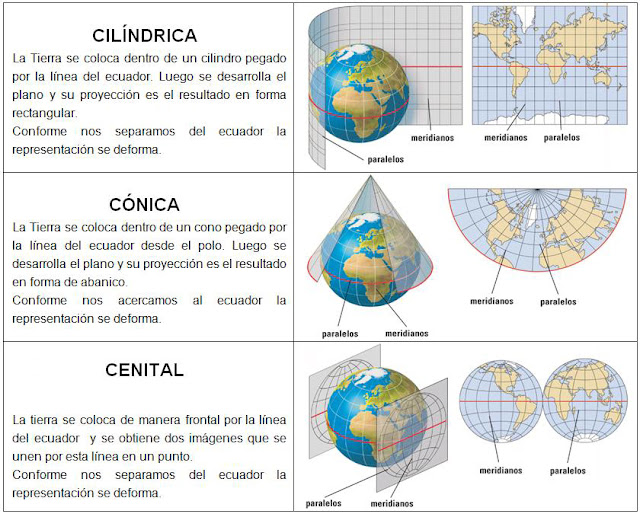
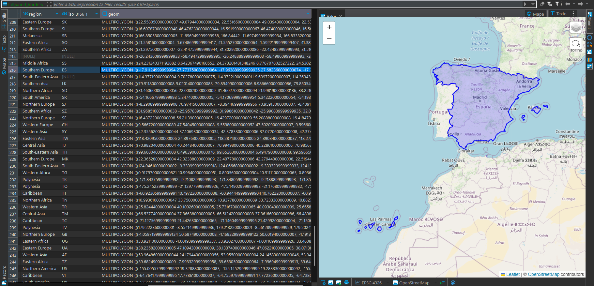
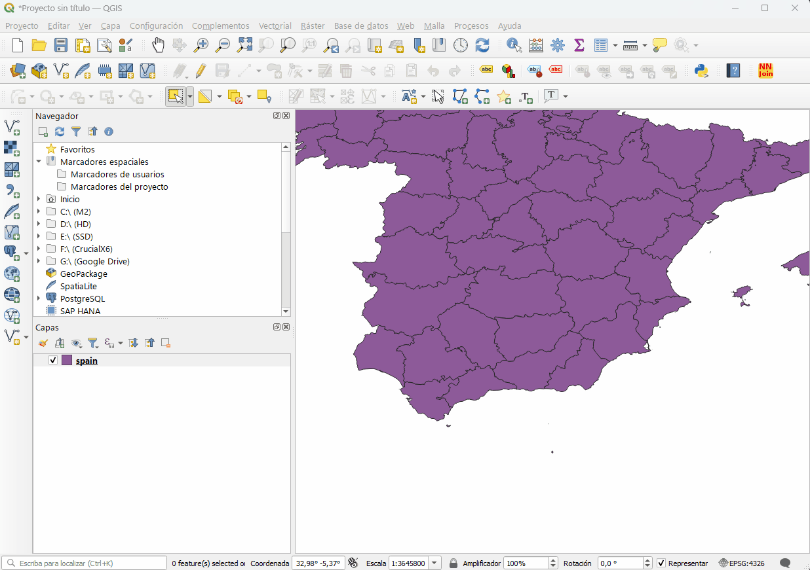
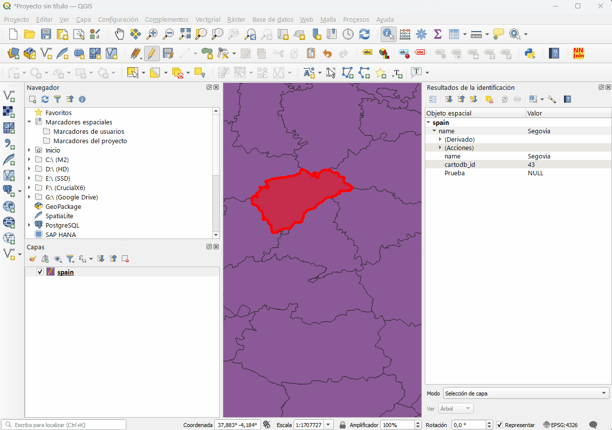
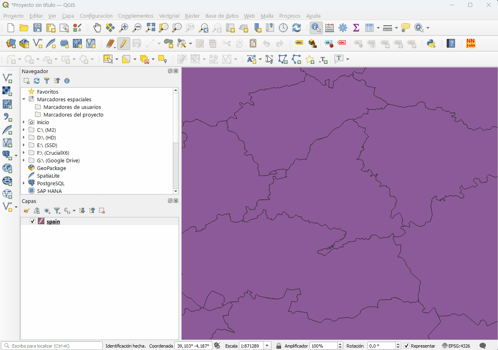
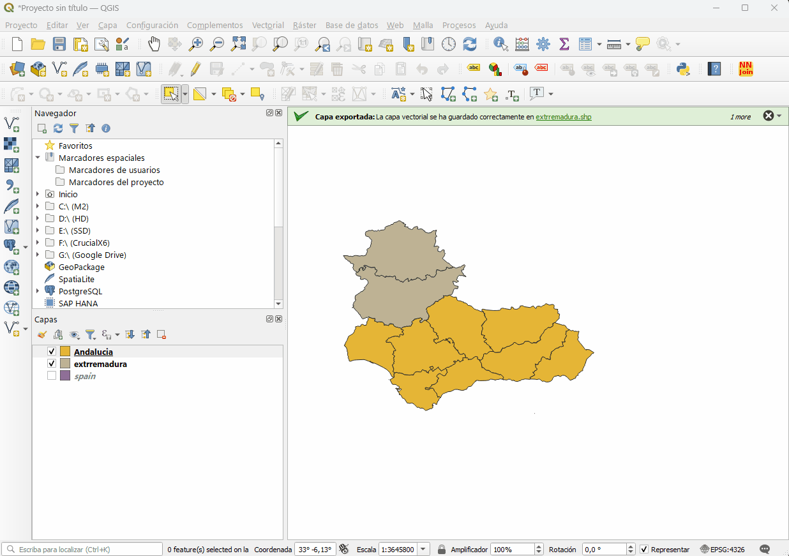
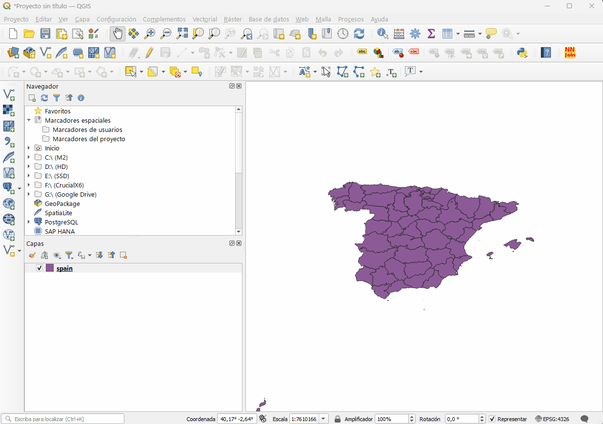
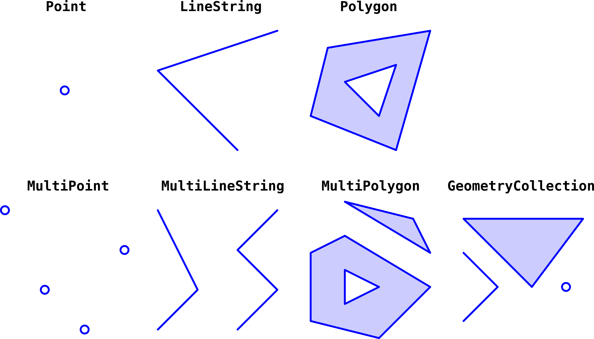

- [1. Pincho sobre Cartografía, React y Deck.gl](#1-pincho-sobre-cartografía-react-y-deckgl)
- [2. Principios básicos sobre cartografía orientada a la web](#2-principios-básicos-sobre-cartografía-orientada-a-la-web)
  - [2.1. Coordenadas geográficas](#21-coordenadas-geográficas)
  - [2.2. Proyecciones cartográficas](#22-proyecciones-cartográficas)
  - [2.3. Formatos de datos geoespaciales](#23-formatos-de-datos-geoespaciales)
  - [2.4. Base de datos geoespaciales](#24-base-de-datos-geoespaciales)
- [3. QGIS](#3-qgis)
  - [3.1. Funcionalidades necesarias en nuestros proyectos](#31-funcionalidades-necesarias-en-nuestros-proyectos)
    - [3.1.1. Importar y exportar datos geoespaciales en diferentes formatos.](#311-importar-y-exportar-datos-geoespaciales-en-diferentes-formatos)
    - [3.1.2. Realizar transformaciones de proyección.](#312-realizar-transformaciones-de-proyección)
    - [3.1.3. Añadir y editar atributos de datos geoespaciales.](#313-añadir-y-editar-atributos-de-datos-geoespaciales)
    - [3.1.4. Combinar o dividir capas de datos geoespaciales.](#314-combinar-o-dividir-capas-de-datos-geoespaciales)
    - [3.1.5. Simplificar geometrías](#315-simplificar-geometrías)
- [4. Formato GeoJSON](#4-formato-geojson)
- [5. @deck.gl](#5-deckgl)
  - [5.1. Capas de visualización](#51-capas-de-visualización)
  - [5.2. Mapa Base](#52-mapa-base)
- [6. Aplicación de demostración de Deck.gl](#6-aplicación-de-demostración-de-deckgl)
  - [6.1. Características clave](#61-características-clave)
  - [6.2. Uso](#62-uso)
  - [6.3. Demostración en vivo](#63-demostración-en-vivo)
  - [6.4. Estructura del código](#64-estructura-del-código)
    - [6.4.1. Detalles técnicos](#641-detalles-técnicos)
    - [6.4.2. Mejoras futuras de este ejemplo](#642-mejoras-futuras-de-este-ejemplo)
  - [6.5. Consideraciones a tener en cuenta](#65-consideraciones-a-tener-en-cuenta)


# 1. Pincho sobre Cartografía, React y Deck.gl

En este pincho, vamos a explorar diferentes aspectos de la cartografía orientada a la web, los formatos de datos geoespaciales y las herramientas de edición y visualización de datos geoespaciales. También vamos a explorar diferentes aspectos de la librería de visualización de datos geoespaciales Deck.gl y cómo se puede integrar con React.

# 2. Principios básicos sobre cartografía orientada a la web

La cartografía es una disciplina que se encarga de la representación gráfica de la Tierra. En la actualidad, la cartografía se ha convertido en una herramienta fundamental para la toma de decisiones en diferentes ámbitos, como la planificación urbana, la gestión de recursos naturales, la gestión de desastres, la navegación, etc. un sin fin de usos que la han convertido en una herramienta fundamental para la toma de decisiones en diferentes ámbitos.

En este pincho, vamos a centrarnos en la cartografía orientada a la web, los formatos de datos geoespaciales y las herramientas de edición y visualización de datos geoespaciales.

## 2.1. Coordenadas geográficas

Las coordenadas geográficas son un sistema de referencia que se utiliza para representar la ubicación de un punto en la superficie de la Tierra. Las coordenadas geográficas se componen de dos valores: la latitud y la longitud.


Los sistemas de coordenadas geográficas más utilizados son:

- WGS84: Las coordenadas geográficas en el sistema WGS84 se expresan en grados decimales.
  
        Ejemplos: - 40.7128° N, 74.0060° W  (formato decimal)
                  - 40° 42' 46.08" N, 74° 0' 21.6" W (formato grado, minuto, segundo)
> Los valores positivos corresponden al hemisferio norte y al este del meridiano central, mientras que los valores negativos corresponden al hemisferio sur y al oeste del meridiano central.

- UTM: Las coordenadas geográficas en el sistema UTM se expresan en metros.
  
        Ejemplo: 18T 583964.601 4507344.285 (formato UTM)
                     - 18: indica el huso UTM.
                     - T: indica la letra de la banda UTM.
                     - 583964.601: indica la coordenada X en metros.
                     - 4507344.285: indica la coordenada Y en metros.
                     

> Las zonas UTM se dividen en 60 husos, cada uno de 6 grados de longitud. Cada huso se divide en 20 bandas, cada una de 8 grados de latitud. Las coordenadas UTM se expresan en metros, y se miden desde el ecuador y el meridiano central del huso.

> Los sistemas de coordenadas geográficas no pueden utilizarse como vectores para realizar cálculos matemáticos, ya que no son lineales. Por lo que es necesario utilizar librerías como Turf.js para realizar cálculos con coordenadas geográficas.

## 2.2. Proyecciones cartográficas

Las proyecciones cartográficas son transformaciones matemáticas que permiten representar la superficie de la Tierra en un plano. Existen diferentes tipos de proyecciones cartográficas, como la proyección cilíndrica, la proyección cónica, la proyección cenital, etc. Cada tipo de proyección cartográfica tiene sus propias características y ventajas, y se utiliza en diferentes contextos y aplicaciones.



>  Más info: http://mapasyotroscuentos.blogspot.com/2016/01/las-proyecciones-cartograficas-o-cuando.html

Hay que entender, que todas las proyecciones cartográficas tienen distorsiones, y que no existe una proyección cartográfica perfecta.

En la web, las proyecciones más utilizadas son:

- Proyección WGS84: es una proyección esférica que se utiliza para la representación de la Tierra en la web. su codificación es EPSG:4326.
- Proyección Web Mercator: es una proyección cilíndrica que se utiliza para la representación de la Tierra en la web. su codificación es EPSG:3857.

La proyección de Web Mercator es el estándar de facto para aplicaciones de mapas web. Saltó a la fama cuando Google Maps lo adoptó en 2005.​ Es utilizado por prácticamente todos los principales proveedores de mapas en línea, incluidos Google Maps, CARTO, Mapbox,3​ Bing Maps, OpenStreetMap, MapQuest, Esri y muchos otros.

Aunque en los últimos años, Google Maps en su versión de escritorio ha adoptado la proyección esférica WGS84.

Normamente cuando importamos un fichero GeoJSON, Shapefile, KML, etc. a una aplicación web, se debe tener en cuenta la proyección del fichero y la proyección del mapa. Si las proyecciones no coinciden, es necesario realizar una transformación de proyección.

## 2.3. Formatos de datos geoespaciales

Los datos geoespaciales son datos que describen la ubicación de objetos en la superficie de la Tierra. Los datos geoespaciales se pueden representar en diferentes formatos, como GeoJSON, Shapefile, KML, GML, etc. En este pincho, nos centraremos en el formato GeoJSON, que es un formato de datos geoespaciales basado en JSON.

Además del formato en si, existen diferencias fundamentales entre los datos geoespaciales vectoriales y raster. Esta diferencia se podría enumerar en los siguientes puntos:

- Datos vectoriales: representan la información geográfica como puntos, líneas y polígonos.
- Datos raster: representan la información geográfica como una cuadrícula de celdas.
- MDT (Modelo Digital del Terreno): representan la información geográfica como una cuadrícula de celdas con valores de altitud.

En cuanto a los formatos:

- GeoJSON: formato de datos geoespaciales basado en JSON.
- Shapefile: formato de datos geoespaciales desarrollado por ESRI.
- KML: formato de datos geoespaciales desarrollado por Google.
- GML: formato de datos geoespaciales basado en XML.
- MDT: Modelo Digital del Terreno.
- GeoTIF: formato de datos geoespaciales raster. (Existen otras variantes como GeoJP2, GeoPNG, etc.)

Por otra parte están los servicios de mapas, que son servicios que proporcionan mapas y datos geoespaciales a través de la web. Algunos de los servicios de mapas más conocidos son Google Maps, Bing Maps, OpenStreetMap, Mapbox, etc.

También existen servidores dedicados, que pueden ser montados en un servidor propio. Algunos de los servidores de mapas más conocidos son GeoServer, MapServer, etc.

Estos servicios requieren de un cliente para poder visualizar los datos, y es aquí donde entran en juego las librerías de visualización de datos geoespaciales. Las más conocidas son Leaflet, OpenLayers, Mapbox GL, Deck.gl, etc.

## 2.4. Base de datos geoespaciales

Las bases de datos geoespaciales son bases de datos que permiten almacenar información geográfica y realizar consultas espaciales. Actualmente, existen diferentes bases de datos geoespaciales, como PostGIS, MongoDB, Cassandra, Oracle Spatial, etc. En este pincho, nos centraremos en PostGIS, que es una extensión espacial para PostgreSQL.

PostGIS proporciona una serie de funciones y operadores espaciales que permiten realizar consultas espaciales, como la intersección, la unión, la diferencia, el buffer, etc. PostGIS también proporciona un conjunto de funciones y operadores para realizar transformaciones de proyección, simplificar geometrías, calcular áreas y longitudes, etc.




Ejemplos de consultas espaciales:
        
```sql
-- Consulta de todos los polígonos que intersectan con un punto
SELECT * FROM poligonos WHERE ST_Intersects(geom, ST_GeomFromText('POINT(0 0)', 4326));

-- Cambia la proyección de un polígono
SELECT ST_Transform(geom, 3857) FROM poligonos;

-- Calcula el área de un polígono
SELECT ST_Area(geom) FROM poligonos;

-- Calcula la longitud de una línea
SELECT ST_Length(geom) FROM lineas;

-- Genera un GeoJSON a partir de un polígono
SELECT ST_AsGeoJSON(geom) FROM poligonos;

-- Genera un GeoJSON a partir de un polígono con atributos
SELECT row_to_json((SELECT d FROM (SELECT id, nombre, ST_AsGeoJSON(geom) AS geom) AS d)) FROM poligonos;

-- Genera un GeoJSON a partir de un polígono con atributos y proyección
SELECT row_to_json((SELECT d FROM (SELECT id, nombre, ST_AsGeoJSON(ST_Transform(geom, 3857)) AS geom) AS d)) FROM poligonos;

-- tabla: spanish_provinces
-- campos: gid, geom, name

-- Consulta que genera un GeoJSON a partir de un polígono con atributos y proyección

SELECT jsonb_build_object(
    'type',     'FeatureCollection', /* Genera un objeto GeoJSON de tipo FeatureCollection */
    'features', jsonb_agg(feature) /* Genera un array de objetos GeoJSON */
)
FROM (
  SELECT jsonb_build_object(
    'type',       'Feature', /* Genera un objeto GeoJSON de tipo Feature */
    'geometry',   ST_AsGeoJSON(geom)::jsonb, /* Genera el campo geom en formato GeoJSON */
    'properties', to_jsonb(row) - 'geom' /* Añade el resto de campos como atributos y elimina el campo geom */
  ) AS feature
  FROM (	
        select
                gid as cartodb_id,   		
                geom,
                name as name
        from
                public.spanish_provinces sp  
  )
 row) features; 
  

```

Con un backend que utilice PostGIS, se pueden realizar consultas espaciales y generar GeoJSON a partir de los resultados de las consultas. Los datos geoespaciales en formato GeoJSON se pueden utilizar por ejemplo en Deck.gl para visualizar los datos en una aplicación web.

> PostGIS: https://postgis.net/


# 3. QGIS

QGIS es un Sistema de Información Geográfica (SIG) de código abierto que permite visualizar, editar y analizar datos geoespaciales. QGIS es una herramienta muy potente y versátil que se utiliza en diferentes ámbitos y aplicaciones rivalizando con otros programas de pago como ArcGIS.


Desde el punto de vista como programadores, QGIS es una herramienta muy útil para la edición y visualización de datos geoespaciales. QGIS permite importar y exportar datos geoespaciales en diferentes formatos, realizar análisis espaciales, crear mapas temáticos, etc. 

> QGIS: https://www.qgis.org/

No es nuestro objetivo la realización de mapas, eso es un trabajo de los cartógrafos, pero si es nuestro objetivo la visualización de datos geoespaciales en aplicaciones web, es importante que sepamos cómo se realizan estos trabajos en QGIS para poder entender los datos que vamos a visualizar y poder realizar las transformaciones necesarias.

## 3.1. Funcionalidades necesarias en nuestros proyectos

Estas son algunas de las funcionalidades que necesitamos para usar en nuestros proyectos:

### 3.1.1. Importar y exportar datos geoespaciales en diferentes formatos.

Para importar datos geoespaciales en QGIS hay muchas maneras, pero por lo general basta con arrastrar el archivo a la ventana de QGIS. Luego hay un montón de opciones para importar desde bases de datos, servicios web, etc.

Para exportar datos geoespaciales en QGIS, se puede hacer clic derecho sobre la capa y seleccionar "Exportar" y luego seleccionar el formato de salida.



### 3.1.2. Realizar transformaciones de proyección.

Para realizar transformaciones de proyección en QGIS, ir a la opción "Vectorial" y seleccionar "Herramientas gestión de datos" y luego "Reproyectar capa". Luego seleccionar la proyección de salida deseada y hacer clic en "Aceptar".



### 3.1.3. Añadir y editar atributos de datos geoespaciales.

Para editar atributos de datos geoespaciales en QGIS, hacer clic sobre el icono de edición de atributos, para añadir un nuevo atributo, hacer clic derecho sobre la capa y seleccionar "propiedades" y luego "campos". 



### 3.1.4. Combinar o dividir capas de datos geoespaciales.

Para dividir capas de datos geoespaciales en QGIS basta con seleccionar los elementos que se quieren dividir y exportar con la opción de solo los elementos seleccionados.

Para combinar capas de datos geoespaciales en QGIS, hacer clic en vectorial y seleccionar "Herramientas de geoproceso" y luego "Unión".



### 3.1.5. Simplificar geometrías

Para simplificar geometrías en QGIS, hacer clic en vectorial y seleccionar "Herramientas de geometría" y luego "Simplificar".

A menudo en necesario/recomendado esta simplificación para reducir el tamaño de los datos y mejorar el rendimiento de la aplicación web.




  

# 4. Formato GeoJSON

El formato GeoJSON es un formato de datos geoespaciales basado en JSON, permite representar diferentes tipos de geometrías, como puntos, líneas y polígonos, y también permite representar atributos asociados a las geometrías.


El formato GeoJSON se compone de dos tipos de objetos:

- Geometrías: representan la forma y la ubicación de los objetos geoespaciales.
- Atributos: representan la información asociada a los objetos geoespaciales.
  
Un ejemplo de un objeto GeoJSON es el siguiente:

```json
{
  "type": "FeatureCollection",
  "features": [
    {
      "type": "Feature", // Tipo de objeto (Feature, FeatureCollection)
      "geometry": {
        "type": "Point", // Tipo de geometría (Point, LineString, Polygon, MultiPoint, MultiLineString, MultiPolygon)
        "coordinates": [102.0, 0.5] // Coordenadas de la geometría
      },
      "properties": {
        "prop0": "value0" // Atributos asociados a la geometría
      }
    },
    {
      "type": "Feature",
      "geometry": {
        "type": "LineString",
        "coordinates": [
          [102.0, 0.0],
          [103.0, 1.0],
          [104.0, 0.0],
          [105.0, 1.0]
        ]
      },
      "properties": {
        "prop0": "value0",
        "prop1": 0.0
      }
    },
    {
      "type": "Feature",
      "geometry": {
        "type": "Polygon",
        "coordinates": [
          [
            [100.0, 0.0],
            [101.0, 0.0],
            [101.0, 1.0],
            [100.0, 1.0],
            [100.0, 0.0]
          ]
        ]
      },
      "properties": {
        "prop0": "value0",
        "prop1": {
          "this": "that"
        }
      }
    }
  ]
}
```

Por lo que la estructura de un fichero GeoJSON es la siguiente:

- Tipo de objeto:
    * **Feature**: representa un objeto geoespacial individual.
    * **FeatureCollection**: representa una colección de objetos geoespaciales.
- Geometría:
    * **Point**: representa un punto.
    * **LineString**: representa una línea.
    * **Polygon**: representa un polígono.
    * **MultiPoint**: representa una colección de puntos.
    * **MultiLineString**: representa una colección de líneas.
    * **MultiPolygon**: representa una colección de polígonos.



- Atributos: representan la información asociada a los objetos geoespaciales. Los atributos se representan como pares clave-valor, pueden ser de diferentes tipos, como texto, número, booleano, etc.

# 5. @deck.gl

Deck.gl es un framework de visualización con tecnología de WebGL que proporciona una variedad de visualizaciones de datos en 2D y 3D fáciles de usar y compatibles con grandes conjuntos de datos.

## 5.1. Capas de visualización

Las capas en deck.gl se definen en cuatro categorías:

1. **Core Layers:**: Las capas principales son fundamentales para visualizaciones de datos genéricas y son las más estables y compatibles con deck.gl. como GeoJsonLayer, ScatterplotLayer, etc.
   
2. **Aggregation Layers:**: Estas capas agregan datos de entrada y los visualizan en representaciones alternativas como cuadrículas, hexágonos, contornos y mapas de calor. como pueden ser GridLayer, HexagonLayer, ContourLayer, HeatmapLayer, etc.

3. **Geo Layers:**: Estas capas se centran en visualizaciones geoespaciales y admiten formatos y sistemas de indexación populares. por ejemplo:
     - TileLayer: Para mostrar mapas basados en mosaicos de teselas.
     - TripsLayer: Para visualizar trayectorias de movimiento a lo largo del tiempo.

4. **Mesh Layers:** Estas capas permiten la visualización de modelos 3D, con soporte experimental para escenas en formato glTF.SimpleMeshLayer y ScenegraphLayer
  
Alguna de las capas más comunes son:

- **GeoJsonLayer**: Renderiza datos geoespaciales en formato GeoJSON.
- **IconLayer**: Representa iconos rasterizados en coordenadas dadas. 
- **TextLayer**: Renderiza texto en coordenadas dadas.
- **BitmapLayer**: Renderiza imágenes georreferenciadas.
- **ArcLayer**: Renderiza arcos elevados que unen pares de coordenadas de origen y destino.
- **ColumnLayer**: Renderiza cilindros extruidos (polígonos regulares teselados) en coordenadas dadas. 
  
> Más info: https://deck.gl/docs/api-reference/layers

## 5.2. Mapa Base

Los mapas base ofrecen contexto para visualizar datos geoespaciales. deck.gl se integra con diversos proveedores de mapas base mediante dos métodos:

1. **Superpuesto:** Deck se muestra sobre el mapa base como un elemento independiente. Es robusto y adecuado para mapas 2D.

2. **Entrelazado:** Deck se integra con el contexto WebGL del mapa base, permitiendo la ocultación entre capas. La disponibilidad depende de las API del proveedor. 


> Más info: https://deck.gl/docs/get-started/using-with-map


```jsx
import { DeckGL } from '@deck.gl/react';
import { GeoJsonLayer } from '@deck.gl/layers';
import Map  from "react-map-gl";

/* Capa GeoJsonLayer 
*  Representa datos de la ciudad de Vancouver en formato GeoJSON
*  Cada polígono representa un bloque de la ciudad
*  La altura de cada polígono se basa en el valor de la propiedad valuePerSqm
*  El color de cada polígono se basa en el valor de la propiedad growth
*/
const geojsonLayer = new GeoJsonLayer({
  id: 'geojson-layer',
  data: 'https://raw.githubusercontent.com/visgl/deck.gl-data/master/examples/geojson/vancouver-blocks.json',
  opacity: 0.8,
  stroked: false,
  filled: true,
  extruded: true,
  wireframe: true,
  getElevation: f => Math.sqrt(f.properties.valuePerSqm) * 500,
  getFillColor: f => colorScale(f.properties.growth),
  getLineColor: [255, 255, 255],
  pickable: true
});
// Vista inicial del mapa, las coordenadas son de la ciudad de Vancouver 
// con inclinación y orientación de la cámara para dar un efecto 3
const INITIAL_VIEW_STATE = {
  latitude: 49.254,
  longitude: -123.13,
  zoom: 11,
  bearing: 140,
  pitch: 60
};D

<DeckGL
  initialViewState={INITIAL_VIEW_STATE} // Vista inicial
  controller={true} // Habilita el control de la cámara
  layers={[geojsonLayer]}>
    <Map
        mapStyle="https://basemaps.cartocdn.com/gl/voyager-nolabels-gl-style/style.json"
        /> <!-- Mapa de fondo usando Mapbox y los servicios de Carto -->
</DeckGL>

```

# 6. Aplicación de demostración de Deck.gl

Esta aplicación React demuestra las capacidades de Deck.gl para la visualización geoespacial interactiva. Permite a los usuarios explorar datos de población mundial, filtrar por continente, ajustar parámetros de estilo y mostrar información adicional al pasar el cursor.

## 6.1. Características clave

- **Mapa interactivo:** Utiliza `react-map-gl` para renderizar un mapa base y posicionar la visualización.
- **Datos de población mundial:** Aprovecha las capas GeoJSON para mostrar las fronteras mundiales y los datos de población.
- **Filtrado por continente:** Permite a los usuarios seleccionar un continente específico para resaltar países.
- **Estilo dinámico:** Proporciona controles para ajustar el ancho de línea, las escalas de color y la elevación en función de la población.
- **Interacciones al pasar el cursor:** Muestra información detallada sobre los países al pasar el cursor, incluidas las estimaciones de población.

## 6.2. Uso

1. **Clonar el repositorio:**
   ```bash
   git clone https://github.com/alexwing/deck.gl-demo-visualization-test.git
   ```
2. **Instalar dependencias:**
   ```bash
   cd deck.gl-demo-visualization-test
   npm install
   ```
3. **Ejecutar la aplicación:**
   ```bash
   npm start
   ```

## 6.3. Demostración en vivo

Visite [enlace a la demostración en vivo] para experimentar la aplicación de forma interactiva.

## 6.4. Estructura del código

- `App.tsx`: El componente principal que renderiza la aplicación y maneja el estado global.
- `DeckMap.tsx`: El componente principal responsable de renderizar el mapa, las capas y manejar las interacciones del usuario.
- `Utils.js`: Contiene funciones de utilidad para la manipulación y cálculo del color.
- `ToolsPanel.tsx`: El componente que proporciona controles para ajustar el estilo y el filtrado de datos.
- `MenuTop.tsx`: El componente que proporciona controles para seleccionar dos vistas predefinidas.
- `db/`: Almacena los archivos de datos GeoJSON (`vancouver-blocks.geojson`, `world-population.geojson`, `spain.geojson`).

### 6.4.1. Detalles técnicos

- **Bibliotecas:** React, react-map-gl, Deck.gl
- **Formato de datos:** GeoJSON

### 6.4.2. Mejoras futuras de este ejemplo

- Explorar capas Deck.gl adicionales como ArcLayer, HexagonLayer y GridCellLayer.
- Integrar una leyenda para visualizar la escala de color y la distribución de la población.

## 6.5. Consideraciones a tener en cuenta

Usar la versión de "react-map-gl": "5.3.21" ya que a partir de la versión 6.0.0, se requiere una clave de acceso a Mapbox para usar el servicio de mapas. Ya existen un proyecto de código abierto llamado mapLibre que permite usar mapas de Mapbox sin necesidad de una clave de acceso. Realmente en principio los limites de uso de Mapbox son muy generosos, pero si se requiere una aplicación con un gran número de usuarios, puede ser una limitación.

> *Con la v2.0, Mapbox GL JS se volvió propietario y requiere una cuenta de Mapbox para usarlo, incluso si no carga teselas del servicio de datos de Mapbox. Los forks de la comunidad del código base v1, como MapLibre GL JS, generalmente se pueden usar como un reemplazo directo de mapbox-gl.*


